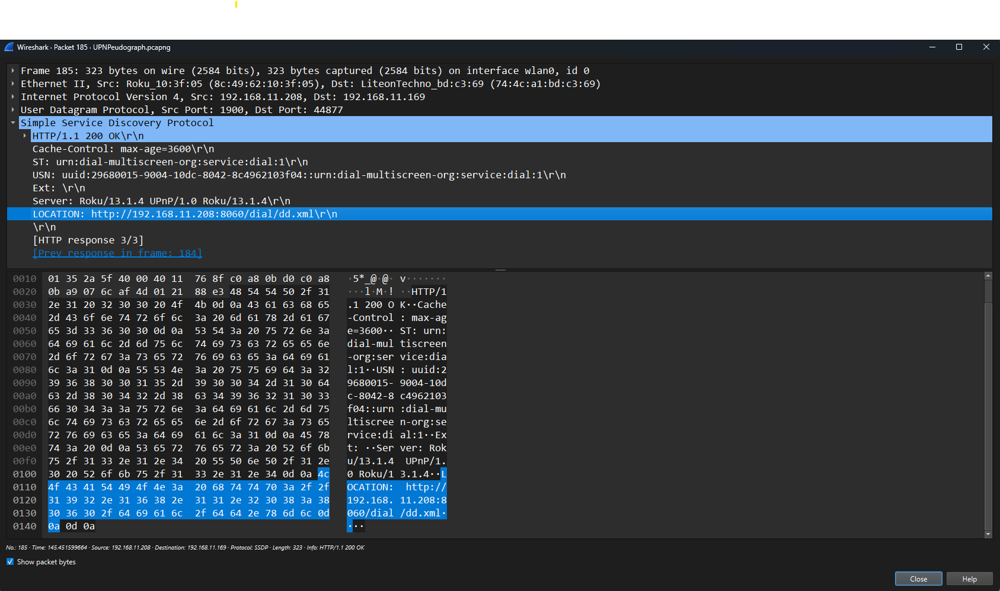
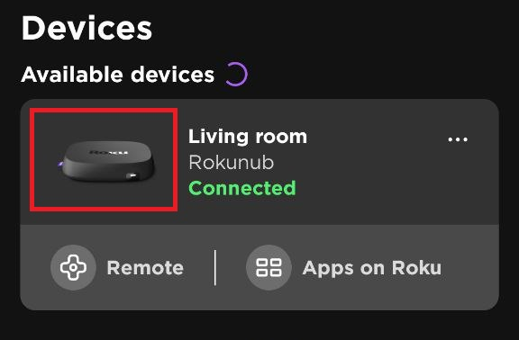

In this paper, a storage covert channel is demonstrated that clones UPNP devices, specifically a Roku device, and embeds encrypted payloads into the device icons as specified by the device information. An implementation was tested and achieved a 9.5k per request bandwidth. While novel, this covert channel could be detected by a passive warden but may still be utilized in networks that do not have passive warden protection, such as home or small business networks.

# Related Work

UPNP covert channels have been researched in the past. Mohamed et al. implemented a timing covert channel by enabling and disabling ports selectively to encode information from a sender and port scanning by a receiver [2]. Monette et al. did a similar implementation using port knocking to expose ports to the internet, allowing external receivers to receive data [3]. Both implementations have bandwidth related to the number of ports used and the frequency of port scans. Detectability is also related to those factors, making detectability and bandwidth inversely proportional. To evade detection, these covert channels would be low-bandwidth in nature, with Monette et al. demonstrating a 5+ character/minute bandwidth explicitly [3].

# Overview

UPNP devices usually service requests using HTTP or Websockets. When devices are looking for Universal Plug and Play (UPNP) devices, they use SSDP broadcast messages to request information about devices and/or services. Specifically, a M-SEARCH request with `ssdp:all` or `upnp:rootdevice` is specified in the `MAN` field is broadcast with UDP to `239.255.255.250` on port `1900`. An `MX` value is specified in discover requests to specify the number of seconds devices have to respond. Devices then respond directly to the requestor with a Simple Service Discovery Protocol (SSDP) message providing various information. All requests and responses are formatted with HTTP/1.1 [1] [6]. Below is an example of one such response from a Roku device:



Here are the contents of an SSDP discovery request observed during testing:

```plaintext
M-SEARCH * HTTP/1.1
HOST: 239.255.255.250:1900
MAN: "ssdp:discover"
MX: 1
ST: ST: urn:dial-multiscreen-org:service:dial:1
USER-AGENT: Chromium/125.0.6422.112 Windows
```

In a query to the target Roku device, we see a reference to `http://192.168.11.208:8060/dial/dd.xml` which provides detailed information about the device:

```xml
<root xmlns="urn:schemas-upnp-org:device-1-0">
<specVersion>
    <major>1</major>
    <minor>0</minor>
</specVersion>
    <device>
    <deviceType>urn:roku-com:device:player:1-0</deviceType>
    <friendlyName>Rokunub</friendlyName>
    <manufacturer>Roku</manufacturer>
    <manufacturerURL>http://www.roku.com/</manufacturerURL>
    <modelDescription>Roku Streaming Player Network Media</modelDescription>
    <modelName>4670RW</modelName>
    <modelNumber>4670RW</modelNumber>
    <modelURL>http://www.roku.com/</modelURL>
    <serialNumber>YJ00ET318530</serialNumber>
    <UDN>uuid:29680015-9004-10dc-8042-8c4962103f04</UDN>
    <iconList>
        <icon>
            <mimetype>image/png</mimetype>
            <width>360</width>
            <height>219</height>
            <depth>8</depth>
            <url>device-image.png</url>
        </icon>
    </iconList>
    <serviceList>
        <service>
            <serviceType>urn:roku-com:service:ecp:1</serviceType>
            <serviceId>urn:roku-com:serviceId:ecp1-0</serviceId>
            <controlURL/>
            <eventSubURL/>
            <SCPDURL>ecp_SCPD.xml</SCPDURL>
        </service>
        <service>
            <serviceType>urn:dial-multiscreen-org:service:dial:1</serviceType>
            <serviceId>urn:dial-multiscreen-org:serviceId:dial1-0</serviceId>
            <controlURL/>
            <eventSubURL/>
            <SCPDURL>dial_SCPD.xml</SCPDURL>
        </service>
    </serviceList>
    </device>
</root>
```



Above is the image icon as displayed in the Roku app.

# Implementation

The implementation consisted of four primary components:

- UPNPDevice
  - A class dedicated to searching for and cloning a UPNP device, acting as a proxy to the original device to mitigate inadvertent DoS. This class also manages key exchange.
- UPNPAgent
  - A class that manages the queueing of messages and the execution of commands.
  - Operates in either a C2 or subbordinate mode of operation.
- SecretPixel (Modified)
  - A modified version of SecretPixel by x001 [4] for image stegnography.
  - Modifications allow embedding raw, unencrypted data primarily for the distribution of public keys and not clandestine payloads.
  - Compression was removed and placed on the agents to manage. This allowed the public modulus of the public key to be easily identified.
  - Additional modifications were made to return the bytes of the image file rather than saving them to the file system.
- CLI
  - A basic CLI to allow the C2 and subordinate agents to communicate.
  - Supports message, file request/send, and command execution.

## Encryption and Steganography

In this implementation, RSA 2048 and 4096 were tested. The key encapsulation used by SecretPixel was PBKDF2HMAC, and the data was encrypted with AES 256 CBC. A seed is constructed using the image dimensions, and the order of LSB embedding is determined by shuffling the indicators of the pixels.

## Payload Construction

The payload is then constructed, converted to individual bits, and embedded in the pixels of the image [4]. The final payload takes the form below:

||Length of Payload|Encrypted AES Key|Salt|IV|Encrypted Data|
|-|-|-|-|-|-|
|Size in Bytes|4|256/512|16|16|len(ciphertext)|

## Key Exchange

The first payload encoded in the image icon is the RSA public modulus, which is encoded as big endian bytes in plaintext mode of the modified SecretPixel implementation. An agent finding a device on the network would attempt to extract the public modulus and, if successful, reconstructs the public key with an agreed upon public exponent of `0x10001`. Once the key is constructed, it is indexed in a dictionary based on the device's IP, allowing for connections to multiple agents in the network.

## Covert Channel Operation

After a public key has been received, messages are encrypted and encoded using the modified SecretPixel implementation. The messages will be held in a queue, waiting for the other agent to receive their public key and consume the queued messages.

Agents will periodically make UPNP discover requests, download icons, and attempt extraction with their private key if the IP address is from a known agent. Messages were prefixed with command characters with the below specified functions:

|Command|Functionality|C2 Only Command|
|-|-|-|
|m|Send a plaintext message to be printed and stored in a message history file.|No|
|f|Send a file with file name preserved.|No|
|g|Request a file from the agent host.|Yes|
|c|Execute a command on the agent host and return the stdout/stderr.|Yes|

All payloads after the command character are plaintext, with the exception of the file command. For files, the size of the file name is encoded as 4 big endian encoded bytes. The payload then takes the following format:

||Command Char|Filename Size|Filename|File Bytes|
|-|-|-|-|-|
|Size in Bytes|1|4|len(filename)|len(filebytes)|

# Bandwidth Calculation

The maximum payload size is related to the number of pixels in the image. Total overhead from the payload size bytes, encrypted key, salt, and IV total 2,366 bits and 4,384 bits for 2048- and 4096-bit RSA, respectively. The maximum payload size can then be computed using the following formula:

$$P_{max} = WH - (R_{bits} + S_{salt} + S_{iv})  $$

|Variable|Description|Variable|Description|
|-|-|-|-|
|$P_{max}$|Maximum payload in bits.|$R_{bits}$|RSA bit strength.|
|$W$|Width of image in pixels.|$S_{salt}$|Salt size in bits.|
|$H$|Height of image in pixels.|$S_{iv}$|IV size in bits.|

The Roku icon at the time of implementation had dimensions of 360x219 pixels, offering a maximum payload of 76536/74488 or 9567/9311 complete bytes for 2048- and 4096-bit RSA, respectively.

Since SSDP broadcast responses are not necessarily received within the `MX` window and because devices tend to poll on intervals ranging between 30 seconds and several minutes (as observed in testing), the payload size is only part of the total bandwidth consideration. Below is a formula that accounts for these variations:

$$ BW = {P_{max} \over I_{discover}P_{response}+{L_{query}}} $$

|Variable|Description|Variable|Description|
|-|-|-|-|
|$P_{max}$|Maximum payload size in bits.|$P_{response}$|Probability an agent responds to discovery within the `MX` window.|
|$I_{discover}$|Interval in seconds for discover requests.|$L_{query}$|Latency between receiving a response and downloading the icon with the embedded payload.|

Assuming a scan interval of 30 seconds and a probability of response of 50%, a covert channel would have a maximum effective bandwidth of 5102/4956 bits per second or 637/620 bytes per second for 2048- and 4096-bit RSA, respectively.

# Limitations

Testing with the Roku device passthrough did not disrupt Roku service with a naive proxy. However, more advanced devices may utilize more robust authentication methods, which would make applying this implementation while preventing degradation or denial of service users infeasible. This also depends on SSDP traffic for UPNP devices to be unhindered, and in more secure networks, SSDP may not be allowed, making this technique generally infeasible.

# Covertness

In testing, a Roku device was still functional despite the SSDP responses confusing the Roku app as to the IP address of the device due to the passthrough functionality. However, a passive warden could detect the covert channel by observing the cloned devices and comparing them against an asset inventory or just noting it as an anomaly in traffic. A passive warden could also detect the proxying of commands between the user, the cloned device, and the actual device. The covert channel code is also run on devices, which, when examined by other SSDP messages originating from the device, indicate that the cloned device is running on another device type. Finally, examining the icons from the cloned and real Roku devices with basic file hashes would reveal that there are differences between the cloned device icons and the actual device icons.

This covert channel could be deployed more covertly if the implementation is only run on compromised devices that match the device type they are cloning. Such an implementation would also be able to directly modify the image without having to clone the device itself in such a scenario. This would enhance the covertness significantly since the network traffic would not require proxying or device duplication and would instead depend on analysis of the compromised device icon hash to detect variations that would be apparent between different payloads.

# Conclusion

UPNP is ubiquitous, and even if port knocking is disabled, local network traffic still utilizes SSDP for devices to discover other devices and services. In home and small business networks, this can be leveraged to implement a high-bandwidth storage channel in the icons of cloned devices on the network. This technique, while novel, is easily detectable by a passive warden but could still be effective in networks without network security analysis, such as home or small business networks.

# References

[1] Contributing Members of the UPnP Forum, “UPnPTM Device Architecture 1.1,” 2008. Available: https://upnp.org/specs/arch/UPnP-arch-DeviceArchitecture-v1.1.pdf. [Accessed: Jul. 23, 2024]

[2] E. E. Mohamed, A. B. Mnaouer, and E. Barka, “PSCAN: A Port Scanning Network Covert Channel,” in 2016 IEEE 41st Conference on Local Computer Networks (LCN), pp. 631–634. doi: https://doi.org/10.1109/LCN.2016.109

[3] S. Monette, D. Johnson, P. Lutz, and B. Yuan, “UPnp Port Manipulation as a Covert Channel,” Jan. 2012, Available: https://repository.rit.edu/other/754/?utm_source=repository.rit.edu%2Fother%2F754&utm_medium=PDF&utm_campaign=PDFCoverPages. [Accessed: Jul. 23, 2024]

[4] x011, “x011/SecretPixel,” GitHub, Mar. 29, 2024. Available: https://github.com/x011/SecretPixel. [Accessed: Jul. 22, 2024]

[5] R. Fields et al., “rfc2616,” datatracker.ietf.org, Jun. 1999. Available: https://datatracker.ietf.org/doc/html/rfc2616
